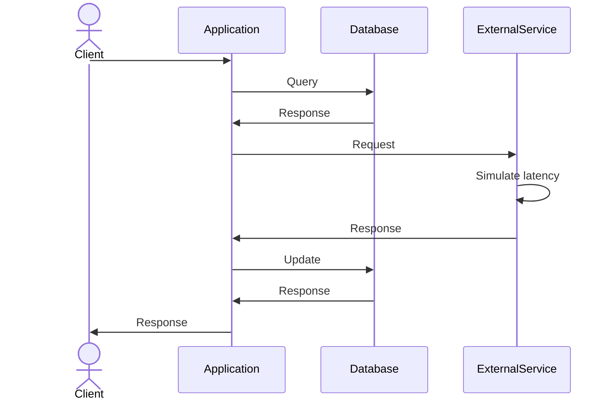
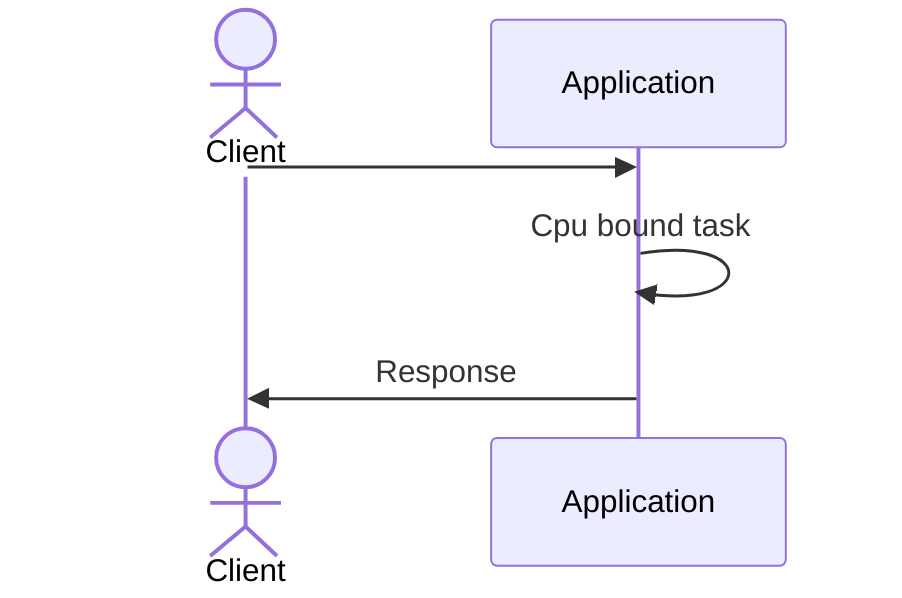
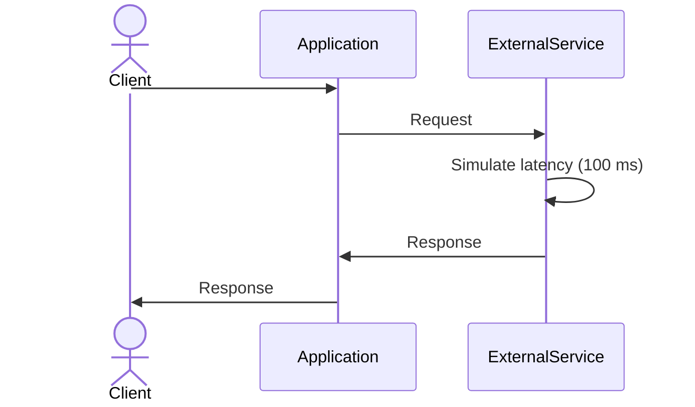
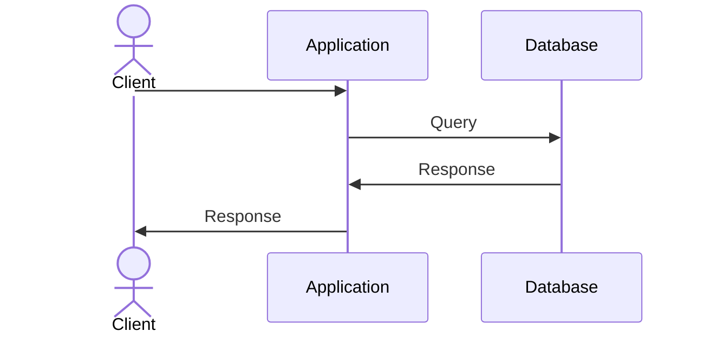
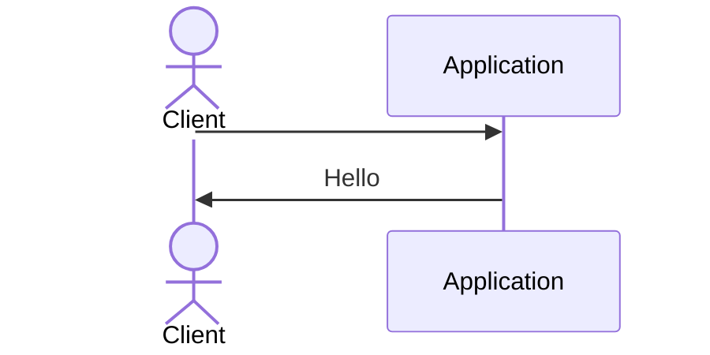

## Results

#### Use case

```mermaid
sequenceDiagram
    actor Client
    Client->>Application: 
    Application->>Database: Query
    Database->>Application: Response
    Application->>ExternalService: Request
    ExternalService->>ExternalService: Simulate latency
    ExternalService->>Application: Response
    Application->>Database: Update
    Database->>Application: Response
    Application->>Client: Response
```

#### CPU-bound task - Prime numbers

```mermaid
sequenceDiagram
    actor Client
    Client->>Application:     
    Application->>Application: Cpu bound task
    Application->>Client: Response
```

#### External service

```mermaid
sequenceDiagram
    actor Client
    Client->>Application: 
    Application->>ExternalService: Request
    ExternalService->>ExternalService: Simulate latency (100 ms)
    ExternalService->>Application: Response
    Application->>Client: Response
```

#### Query Database

```mermaid
sequenceDiagram
    actor Client
    Client->>Application: 
    Application->>Database: Query
    Database->>Application: Response
    Application->>Client: Response
```

#### Hello world

```mermaid
sequenceDiagram
    actor Client
    Client->>Application: 
    Application->>Client: Hello
```

